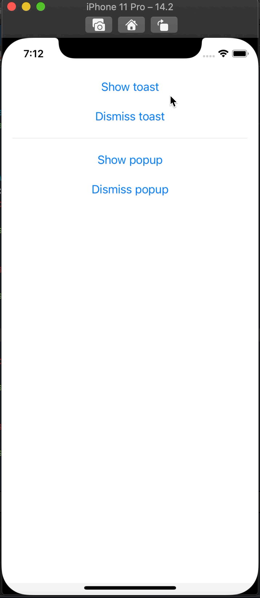

# ToastSwiftUI

A simple way to show a toast message in SwiftUI

## About

SwiftUI is a great thing that Apple brought to iOS developers in 2019. But it still hasn't provided us a way to show a toast, a short time message. Toast message is quite popular in iOS applications, even it is not a native view. This ToastSwiftUI open source will help you to do that easily.



## Example

To run the example project, clone the repo, and run `pod install` from the Example directory first.

## Requirements

- Swift 5.0 or later
- iOS 13 or later

## Installation

#### Cocoapod

ToastSwiftUI is available through [CocoaPods](https://cocoapods.org). To install
it, simply add the following line to your Podfile:

```ruby
pod 'ToastSwiftUI'
```

#### Manual

Sometimes you don't want to use Cocoapod to install. In this case, you need to add it manually. It is very simple, just add Swift files in the `ToastSwiftUI/Classes` to your project.

## Usage

You need to add `toast` modifier, with a `@State Bool`  variable to control when you want to show the toast . Please see below example:

```swift
struct ContentView: View {
    // 1. Add a @State variable to control when showing the toast
    @State private var isShowingToast = false
    
    var body: some View {
        VStack(spacing: 20) {
            Button("Show toast") {
                // 4a. Set @State variable to true if you want to show the toast
                self.isShowingToast = true
            }
            
            Button("Dismiss toast") {
                // 4b. Set @State variable to false if you want to hide the toast
                self.isShowingToast = false
            }
            
            Spacer()
        }
        .padding()
        
        // 2. Add `toast` modifier to your view with the binding variable in step 1
        .toast(isPresenting: $isShowingToast, dismissType: .after(2)) {
            
            // 3. This is the toast will be showed.
            // You can use built-in ToastView, or any custom view created by you.
            ToastView(message: "Hello world!", icon: .success)
        }
    }
}
```

### Customization

#### toast modifier
- Dismiss type
    - none: No auto dismiss, you have to dismiss manually.
    - after(TimeInterval): Auto dismiss after a duration that you pass to.
    - auto(String): Auto dissmiss after a duration that calculated base on the text you show.

#### ToastView
- Icons
    - info
    - error
    - success
    - custom(Image): Show icon as the image you provided.
    - loading: Show icon as a rotating loading indicator.
    
- Background color

- Text color


## Author

Huy Nguyen, conghuy2012@gmail.com

## License

ToastSwiftUI is available under the MIT license. See the LICENSE file for more info.
