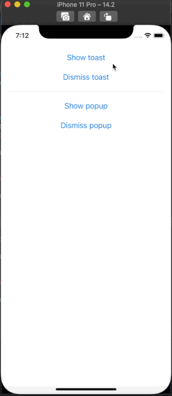

# ToastSwiftUI

A simple way to show a toast or a popup in SwiftUI

## About

SwiftUI is a great thing that Apple brought to iOS developers in 2019. But it still hasn't provided us a way to show a toast, a short time message. Toast message is quite popular in iOS applications, even it is not a native view. This ToastSwiftUI open source will help you to do that easily.

Showing a popup is the same, not too difficult, but there is no native API for it. This open source also helps you.



## Example

To run the example project, clone the repo, and run `pod install` from the Example directory first.

## Requirements

- Swift 5.0 or later
- iOS 13 or later

## Installation

#### Cocoapod

ToastSwiftUI is available through [CocoaPods](https://cocoapods.org). To install
it, simply add the following line to your Podfile:

```ruby
pod 'ToastSwiftUI'
```

Then run `pod install` in your command line.

#### Swift Package Manager
In Xcode, select menu File -> Swift Packages -> Add Package Dependency. Select a target, then add this link to the input field:
`https://github.com/huynguyencong/ToastSwiftUI.git`

#### Manual

Sometimes you don't want to use Cocoapod to install. In this case, you need to add it manually. It is very simple, just add Swift files in the `ToastSwiftUI/Classes` to your project.

## Usage

### Showing a popup

- Step 1: Add a @State variable to control when showing the popup.
```swift
@State private var isPresentingPopup = false
```

- Step 2: Add `popup` modifier to your view with the binding variable in step 1. `MyPopup` is a view that you want to show as a popup. Setting frame is not necessary if you are happy with the intrinsic size of the pop up view
```swift
.popup(isPresenting: $isPresentingPopup, overlayColor: Color.black.opacity(0.4)) {
    MyPopup(isPresenting: $isPresentingPopup)
        .frame(width: 300, height: 500)         // it is not required
}
```

- Step 3: Show the toast by set variable in the step 1 to true. You can also dismiss it by set it to false:
```swift
self.isPresentingPopup = true
```

### Showing a toast

- Step 1: Add a @State variable to control when showing the toast.
```swift
@State private var isPresentingToast = false
```

- Step 2: Add `toast` modifier to your view with the binding variable in step 1.
```swift
.toast(isPresenting: $isPresentingToast, message: "Success", icon: .success)
```

- Step 3: Show the toast by set variable in the step 1 to true. You can also dismiss it by set it to false:
```swift
self.isPresentingPopup = true
```

### Showing a toast with a message state variable
- Step 1: Add a optional `String` `@State` variable. When this optional variable has value, it will trigger a toast.
```swift
@State private var toastMessage: String?
```

- Step 2: Add `toast` modifier, pass the `Binding` ($) of the above message variable as the first param.
```swift
.toast($toastMessage)
```

- Step 3: Show the toast by setting variable in the step 1 to a `String`. You can also dismiss it by set it to `nil`:
```swift
toastMessage = "Hello world!"
```

See the completed code below, it has 3 examples to show both toast and popup in different way:

```swift
import SwiftUI
import ToastSwiftUI

struct ContentView: View {
    // 1.1. Example 1: Add @State variables to control when showing the popup
    @State private var isPresentingPopup = false
    
    // 1.2. Example 2: First way to show a toast. Add @State variables to control when showing the toast
    @State private var isPresentingToast = false
    
    // 1.3. Example 3: Second way to show a toast. Add an optional String @State variables to control when showing the toast
    @State private var toastMessage: String?
    
    @State private var count = 0
    
    var body: some View {
        VStack(spacing: 20) {
            Button("Show a success toast with a boolean variable") {
                // 3.2.1. Set state variable to true if you want to show the toast
                self.isPresentingToast = true
            }
            
            Button("Dismiss the success toast") {
                // 3.2.2. Set state variable to false if you want to hide the toast
                self.isPresentingToast = false
            }
            
            Divider()
            
            Button("Show toast with a text binding") {
                // 3.3.1. Set text variable you want to show
                toastMessage = "Toast number \(count)"
                
                count += 1
            }
            
            Button("Dismiss toast") {
                // 3.3.2. Set text variable to nil
                self.toastMessage = nil
            }
            
            Divider()
            
            Button("Show popup") {
                // 3.1.1. Set state variable to true if you want to show the popup
                self.isPresentingPopup = true
            }
            
            Button("Dismiss popup") {
                // 3.1.2. Set state variable to true if you want to hide the popup
                self.isPresentingPopup = false
            }
            
            Spacer()
        }
        .padding()
        
        // 2.1. Add a `popup` modifier to your view with the binding variable in step 1
        .popup(isPresenting: $isPresentingPopup, popup:
            MyPopup(isPresenting: $isPresentingPopup)
                .background(Color(.systemBackground))
        )
        
        // 2.2. Add a `toast` modifier to your view with the binding variable in step 1
        .toast(isPresenting: $isPresentingToast, message: "Success", icon: .success)
        
        // 2.3. Add a `toast` modifier to your view with the binding variable in step 1
        .toast($toastMessage)
    }
}
```

### Customization

#### `popup` modifier parameters:
- autoDismiss
    - none: No auto dismiss, you have to dismiss manually.
    - after(TimeInterval): Auto dismiss after a duration that you pass to.
    - auto(String): Auto dissmiss after a duration that calculated base on the text you show.
    
- hasShadow
- cornerRadius
- overlayColor
- isTapOutsideToDismiss

#### `toast` modifier parameters:
- autoDismiss
    - none: No auto dismiss, you have to dismiss manually.
    - after(TimeInterval): Auto dismiss after a duration that you pass to.
    - auto: Auto dissmiss after a duration that calculated base on the text you show.
    
- icon
    - info
    - error
    - success
    - custom(Image): Show icon as the image you provided.
    - loading: Show icon as a rotating loading indicator.
    
- backgroundColor
- textColor

## UIKit version
[EzPopup for UIKit](https://github.com/huynguyencong/EzPopup)


## Author

Huy Nguyen, conghuy2012@gmail.com

## License

ToastSwiftUI is available under the MIT license. See the LICENSE file for more info.
